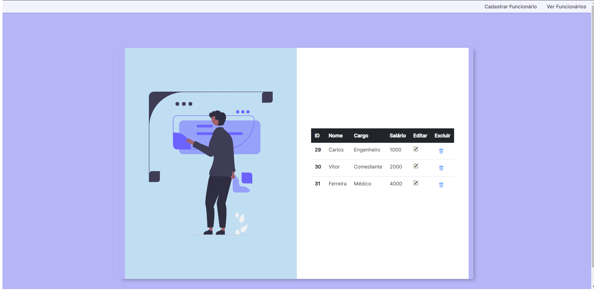
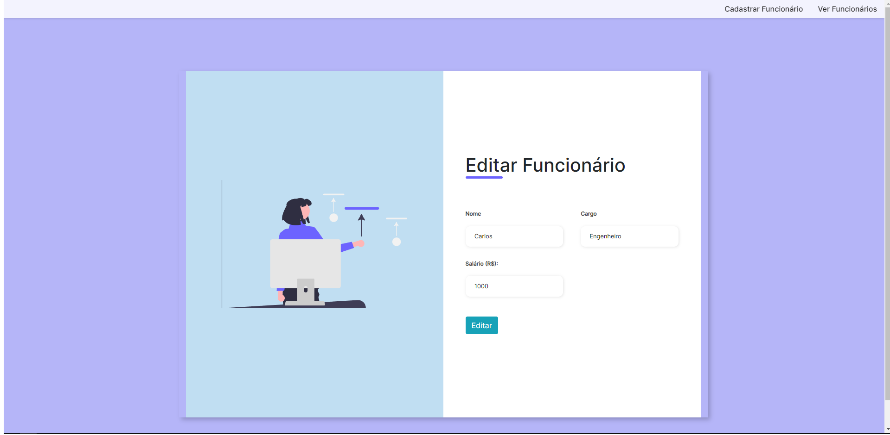

# NodeUsers CRUD

Este é um projeto de CRUD simples em Node.js para gerenciar usuários em um banco de dados MySQL.

## Tecnologias Utilizadas

| Tecnologia         | Descrição                                                                      |
| ------------------ | ------------------------------------------------------------------------------ |
| Node.js            | Ambiente de tempo de execução JavaScript do lado do servidor                   |
| Express.js         | Framework web para Node.js                                                     |
| Sequelize          | ORM para interação com o banco de dados MySQL                                  |
| MySQL2             | Driver para conexão com o MySQL                                                |
| Express Handlebars | Mecanismo de modelo para Express.js                                            |
| Nodemon            | Utilitário para reiniciar automaticamente o servidor durante o desenvolvimento |

## Pré-requisitos

Certifique-se de ter o Node.js e o npm instalados em sua máquina. Você pode baixá-los e instalá-los a partir do [site oficial do Node.js](https://nodejs.org/).

## Instalação

1. Clone este repositório em sua máquina local.
2. Navegue até o diretório do projeto no terminal.
3. Execute o comando `npm install` para instalar todas as dependências.

## Configuração do Banco de Dados

Antes de iniciar a aplicação, certifique-se de configurar corretamente o banco de dados MySQL. Você precisa criar um schema chamado `nodeusers`.

1. Certifique-se de ter um servidor MySQL em execução.
2. Execute o seguinte comando para criar o schema:

```sql
CREATE SCHEMA nodeusers;
```

No arquivo `db/conn.js`, verifique e atualize as informações de conexão com o seu banco de dados MySQL, se necessário:

```javascript
const { Sequelize } = require("sequelize");

const sequelize = new Sequelize("nodeusers", "root", "sua_senha", {
  host: "localhost",
  dialect: "mysql",
});

try {
  sequelize.authenticate();
  console.log("Banco de dados MySql conectado!");
} catch (erro) {
  console.log(`Não foi possível conectar ao banco de dados, ERRO: ${error}`);
}

module.exports = sequelize;
```

Substitua `"sua_senha"` pela senha do seu banco de dados MySQL, se aplicável.

## Executando a Aplicação

Após a configuração do banco de dados, você pode iniciar a aplicação com o comando:

```bash
npm start
```

Este comando iniciará o servidor Node.js e estará disponível em [http://localhost:3000](http://localhost:3000).

## Acessando a Interface

Ao acessar [http://localhost:3000](http://localhost:3000), você será redirecionado para a interface de visualização dos funcionários.

## Uso

A interface de usuário é acessada diretamente em [http://localhost:3000](http://localhost:3000). Você pode visualizar, adicionar, atualizar e excluir funcionários diretamente por meio da interface web.

### Prints do Sistema





